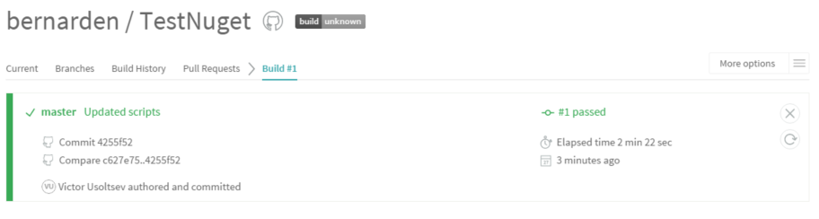

Create Your First NuGet
=======================

Helps to setup Travis-CI for continuous integration and to publish your NuGet.

Features
--------
Why should I use this template?

 - Contains well documented instructions about the setup process.
 - Contains scripts for building your project, auto incrementing version and publishing your created NuGet to private and/or public hosting server.
 - After setup is done you get:
	* the state of your build.
	* automatically published NuGet packages.
	* possibility to automate test runs before each build and much more.


Instructions
-----	
1) Create “Class Library” in Visual Studio and add the code you want to be in your library.

2) Copy the following from Template folder to root folder of your project:
- Folder: "Scripts"
- Files: ”.gitignore”, “.travis.yml” , “LICENCE”, “README.md” 
	
3) Create new empty repository on github. Note repository’s URL for the next couple steps.

4) Create YourProjectName.nuspec file in the root folder and add the following:

```xml
<?xml version="1.0"?>
<package>
    <metadata>
        <!-- The unique identifier for the package. This is the package name that is shown when packages are listed using the Package Manager Console. These are also used when installing a package using the Install-Package command within the Package Manager Console. Package IDs may not contain any spaces or characters that are invalid in an URL. In general, they follow the same rules as .NET namespaces do. So Foo.Bar is a valid ID, Foo! and Foo Bar are not. -->
        <id>ProjectName</id>
        <version></version>
        <title>Project Name</title>
        <authors>First name Last name</authors>
        <owners>Intergen Ltd</owners>
        <licenseUrl>http://www.apache.org/licenses/LICENSE-2.0</licenseUrl>
        <projectUrl>GitHubURL</projectUrl>
        <iconUrl>https://avatars2.githubusercontent.com/u/17167744</iconUrl>
        <requireLicenseAcceptance>false</requireLicenseAcceptance>
        <description>Description</description>
        <releaseNotes>Notes</releaseNotes>
        <copyright>Copyright 2016</copyright>
        <tags>Tag Tag2</tags>
        <dependencies>
            <dependency id="DependencyProjectName" version="1.0.0.0" />
        </dependencies> 
    </metadata>
    <files>
        <file src="ProjectName\bin\Release\ProjectName.dll" target="lib" />
    </files>
</package>
```
5) Replace information in xml tags with project specific one.
- Leave version tag empty. Version will be taken from AssemblyInfo.cs file.
- Add dependencies if your project requires them, otherwise comment out dependency tag. 
  You can find dependencies in “packages.config”. 
- Make sure to read Licence file and sign it at the end (line 189) or pick a licence that suits your needs.
- Intergen use: Do not modify Owners, LicenseUrl, IconUrl and Copyright. Licence is already signed.

6) Follow these [GitHub Instructions](https://help.github.com/articles/adding-an-existing-project-to-github-using-the-command-line/) to push local repository to git repository **or** execute the following commands:

```
git init
git add .
git commit -m "Created project"
git remote add origin YourGithubURL
git push origin master

```
7) Login in [Travis CI](https://travis-ci.org/) with GitHub credentials. (allow it to access your repositories)

8) Add Repository to Travis CI and then go into settings.


9) Set switches as shown on a screenshot below. Also set variables with appropriate to your project values.


 Variable       | Value           | IsVisible |
|:------------- |:-------------:| ----- |
| ProjectName    | YourProjectName | Yes |
| AssemblyFilePath | YourProjectName/Properties/AssemblyInfo.cs      |    Yes |
| Is_Uploading_Nuget_To_Private_Server     | True      |   Yes |
| Private_Nuget_Server_Repo_URL | XXXXXXXXX      |    No |
| Private_Nuget_Server_URL | XXXXXXXXX      |    No |
| Private_Nuget_API_Key | XXXXXXXXX      |    No |
| Is_Uploading_Nuget_To_Public_Serever | False      |    Yes |
| Public_Nuget_API_Key | XXXXXXXXX      |    No |

- Private_Nuget_Server_Repo_URL: Url where NuGet packages can be downloaded from.
- Private_Nuget_Server_URL: Url where NuGet packages can be uploaded to.

10) Modify something and push it to your repository. (This will start a new build.)


11)  If everything has been setup correctly your build succeeds and your NuGet gets published. Congratulations! 




Note:
- All future build versions (major and minor) should only be adjusted in AssemblyInfo.cs. Build number is set by Travis-CI automatically.
- Status "Pass" doesn't guarantee successful deployment of the NuGet package
- If your build fails look through the generated log file. Usually errors are self-explanatory.


Credits
-------
Victor Usoltsev, 2016
